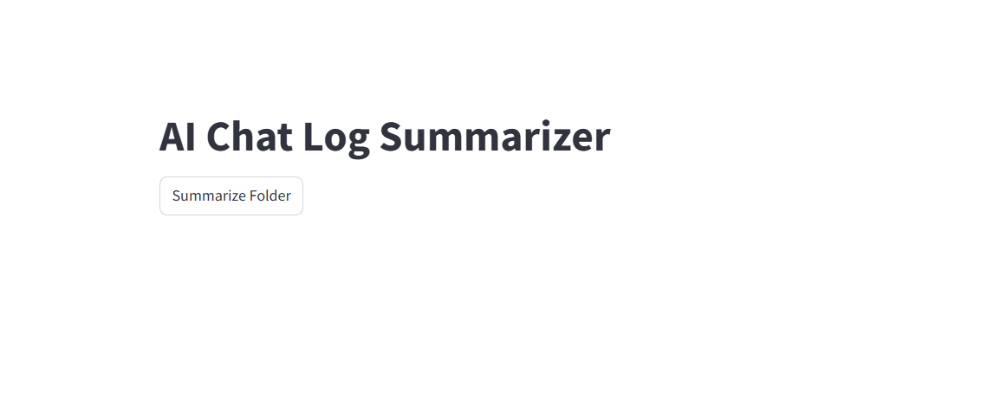
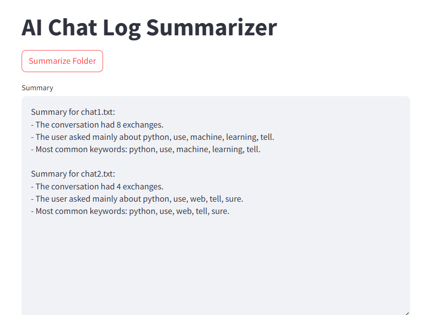

# AI Chat Log Summarizer

## Project Overview
This Python-based tool reads chat logs between a user and an AI from `.txt` files, parses the conversations, and generates a summary that includes message statistics and frequently used keywords. The tool uses basic NLP techniques and optionally a TF-IDF approach for keyword extraction.

## Features
- Parses chat logs separating messages by speaker (User and AI).
- Counts total messages and messages per speaker.
- Extracts top 5 keywords excluding common stopwords and conversational fillers.
- Generates a natural language summary including:
  - Total number of exchanges.
  - Nature of the conversation based on keywords.
  - Most common keywords.
- Optional: Supports summarizing multiple chat logs from a folder.

## Requirements
- Python 3.6 or higher
- Libraries: `tf-idf`, `nltk`, `scikit-learn`, `streamlit`

## Installation

1. Clone the repository:
   ```bash
  git clone https://github.com/Mizan116/qtec.git
  cd qtec

## 🧠 Methodology
This project, AI Chat Log Summarizer, is designed to read .txt chat logs between a user and an AI, extract meaningful information, and generate a structured summary. The methodology follows a modular and explainable approach from input parsing to output generation. Below are the detailed steps:

### 📁 1. Chat File Parsing
Goal: Extract and categorize messages from the chat log.

The script reads .txt files line by line.

Each line is expected to follow a format:


User: message text
AI: message text
Based on the prefix (User: or AI:), the message is appended to the corresponding list: user_msgs or ai_msgs.

### 🧹 2. Text Cleaning
Goal: Prepare text data for keyword analysis.

All messages from both User and AI are combined.

A regular expression (\b[a-z]+\b) is used to extract lowercase alphabetic words.

Common stop words (e.g., "the", "is", "and") are removed using nltk's English stopword list.

Additional conversational fillers like “hi”, “bye”, “ok”, and “thanks” are manually excluded, as they do not reflect the core topic of the conversation.

### 🔑 3. Keyword Extraction
Goal: Identify the top 5 most frequent and meaningful words from the chat.

All cleaned words are combined into a single list.

Using Python's collections.Counter, word frequencies are counted.

The top 5 most common keywords are selected after filtering.

### 🧾 4. Summary Generation
Goal: Create a user-friendly summary including:

Total number of exchanges (User + AI messages).

Nature of the conversation: Described based on the most common keyword topics (excluding small talk).

List of the top 5 keywords.

Example Output:

Summary for chat1.txt:
- The conversation had 15 exchanges.
- The user asked mainly about python, data, language, learning, analysis.
- Most common keywords: python, data, language, learning, analysis.
If no meaningful keywords are found, it defaults to:

"The user asked mainly about general topics."

### 📂 5. Batch Processing (Folder Support)
Goal: Process multiple .txt chat logs at once.

The function parse_chat_folder(folder_path) iterates through all .txt files in a folder.

Each file is processed individually using the main parsing logic.

Final output is a combined summary of all chat logs.

### 🧪 6. Libraries and Tools Used
nltk: for stopword removal.

re: for pattern matching and word tokenization.

collections.Counter: for frequency analysis.

os: for file navigation.

## 🧠 Design Philosophy
Simplicity: The project avoids heavy dependencies or complex ML models.

Modularity: Each function is reusable and independently testable.

Clarity: All logic is transparent and explained for easy understanding.


## Extra work(Develop a streamlit app for frontend)
## For running app
1. install streamlit in VS code
2. use `streamlit run app.py`
3. use your local folder path and log folder in replace of "C:\Users\ASUS\Desktop\QTec Task\input folder" 
`
### 🧾 Sample Output (Intro Page after opening the streamlit app)



### 🧾 Sample Output (Summary pages after clicking the 'Summarize folder' button')



